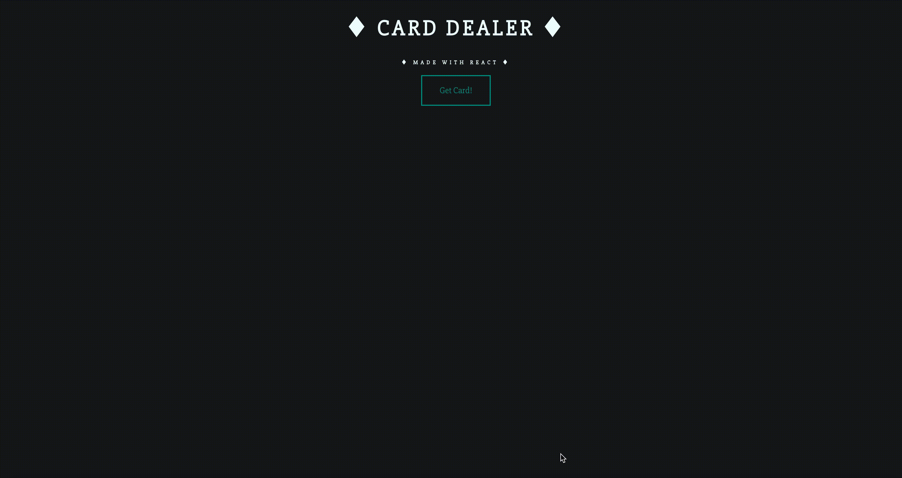

# [Card Dealer App](https://card-dealer-app.netlify.app/)

A Simple React Card Dealer App built using Deck of Cards API.
[Deployed App](https://card-dealer-app.netlify.app/)

## Short demo:

## Installation

1. `git clone git@github.com:dorabelme/Card-Dealer.git`
2. `npm install`
3. `npm start`
